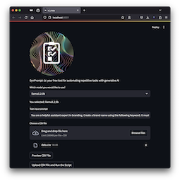

# DynPrompt-1s

Dynamic Prompt Assistant - Single Agent with Streamlit UI 



## Key Features

``Automate repetitive tasks using gen AI.``

``$0 subscription fee. 100% data privacy.``

## About the Project

PyCon Hong Kong 2024 Sprint project. 

This Python app utilises gen AI for repetitive, similar tasks. This allows users to input task details into a CSV format, efficiently delegating these responsibilities to a locally hosted large language model powered by Ollama. The system then generates responses and returns them in a readily usable CSV format.

## Technical Details

- Python version: 3.11
- Libraries used: ollama-python
- Dependencies required: pandas, streamlit 

## Installation and Usage

Download and install Ollama from ``https://ollama.com/download`` 

In Terminal: 

```
pip install ollama 
ollama pull llama3.2:3b
```

```
pip install pandas streamlit 
```

### Prep data.csv

``prompt_var`` is the content of your task. 

Paste each of them in the ``prompt_var`` column in separate rows. 

### Set your prompt 

Edit your prompt under ``Base prompt`` section in ``app.py``. Use prompt engineering techniques for desired results. 

Example use cases: 

- Text extractor for email
    ```
    prompt = f"""
        Given is an email from contains product code and corresponding remarks. Identify the product code and remarks within the original text. 
        
        Provide the product code and remark only in csv format, ready to save. Exclude the "```csv" declaration, don't add spaces after the comma, include column headers.

        Format:
        product_code, remark
        product_code_1, remark_1
        ...
        
        Email:
        """
    ```

- Customer review text classifier 
    ```
    prompt = f"""
        Respond with "Positve" or "Negative": 
        the comment is a product reivew, describing an user experience. 

        Comment:
        """
    ```

### Run app.py

```
cd DynPrompt-1s
streamlit run ui.py 
```

### Results in responses.csv 

``responses.csv`` is saved in the same folder. Open in Excel. 

## Challenges and Limitations

The responses are largely depend on the LLM in use, and prompt engineering techniques. 

Prompt engineering techniques can be refined with resources mentioned above. 

What LLM model could be used depends on your hardware. The better the LLM model, the higher RAM and VRAM requirements. 

In this script in particular, I am using ``llama3.2:3b`` on MacBook M3 Pro ``18GB RAM``. You may run into errors if your VRAM is insufficient. 

Check in terminal to see if Ollama is running correctly. Or edit the script for a smaller LLM accordingly. 

```
ollama run llama3.2:3b
```
